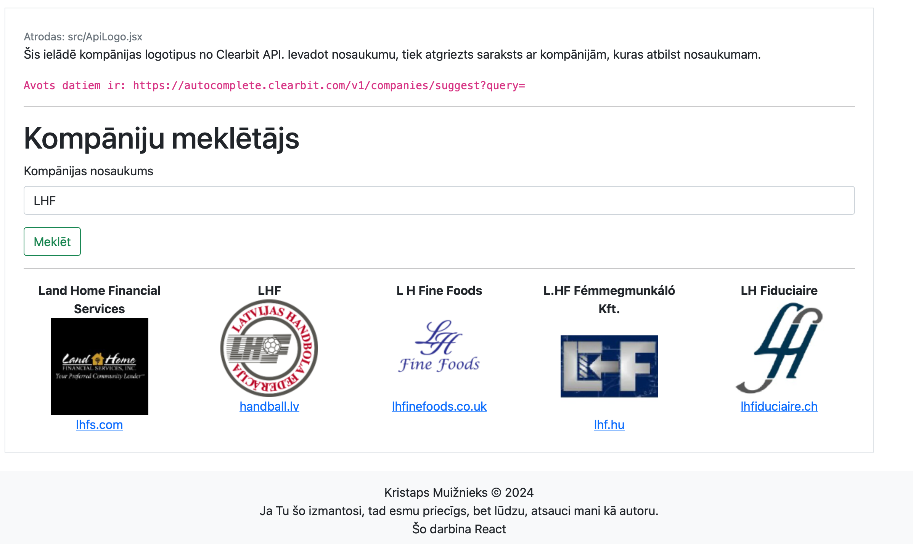

   

# Reacta Tests

Šajā projektā es izmēģināju React iespējas, lai saprastu, kā tas darbojas. Šeit nav nekā ultra advancēta.

## Izmantošana

Lai izmantotu šo projektu, vispirms jāuzstāda npm.

Tad laižam `npm install` un pēc tam `npm start dev`.

Ja gribam izveidot buildu, tad `npm run build`.

## Kā tas izskatās?

